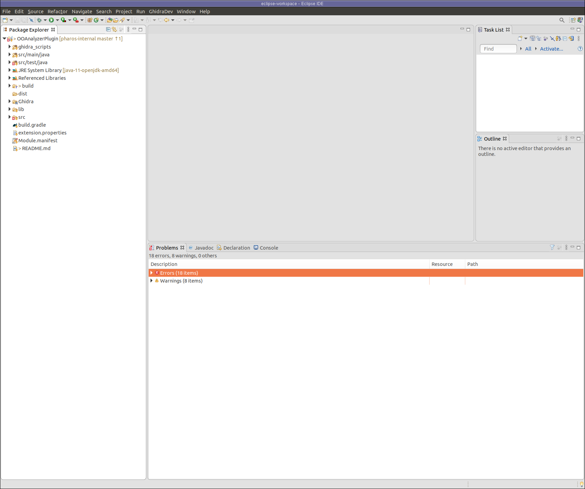

# OOAnalyzer Plugin for Ghidra

The new OOAnalyzer Ghidra plugin is a standard Ghidra extension that
can load, parse, and apply OOAnalyzer results to object oriented C++
executables in a Ghidra project. When launched, the plugin will prompt
the user for the JSON output file produced by OOAnalyzer that contains
information about recovered C++ classes. Upon loading the JSON file,
recovered C++ data types and symbols found by OOAnalyzer are updated
in the Ghidra Code Browser. The plugin's design and implementation
details are described in our SEI blog post titled [Using OOAnalyzer to
Reverse Engineer Object Oriented Code with
Ghidra](https://insights.sei.cmu.edu/sei_blog/2019/07/using-ooanalyzer-to-reverse-engineer-object-oriented-code-with-ghidra.html).

## Building the Plugin

We are providing experimental pre-built versions of the plugin.  You
can find the latest releases [in this github
repository](https://github.com/sei-eschwartz/pharos/releases).  The
builds are generated by [this azure
pipeline](https://github.com/sei-eschwartz/pharos/releases).

[](https://dev.azure.com/seipharos/pharos/_build/latest?definitionId=2&branchName=master)

### Gradle

The recommended method of building the OOAnalyzer Ghidra plugin is
using Gradle.  Make sure you have Gradle 5.0 or later installed, and
then run the following command from the
`pharos/tools/ooanalyzer/ghidra/OOAnalyzerPlugin` directory:

```
GHIDRA_INSTALL_DIR=/path/to/ghidra gradle
```

If all goes well, you should see a message like the following that tells you the name of your built plugin.
```
Created ghidra_9.1.2_PUBLIC_20200430_OOAnalyzerPlugin.zip in /home/user/Documents/pharos/tools/ooanalyzer/ghidra/OOAnalyzerPlugin/dist
```

### GhidraDev

The plugin can also be built using Ghidra's Eclipse plugin, GhidraDev.
This is for advanced users only, and we _highly_ recommend using Gradle instead.

First start by
[installing](https://initrd.net/stuff/ghidra/GhidraBuild/EclipsePlugins/GhidraDev/GhidraDevPlugin/GhidraDev_README.html#AutoInstall)
GhidraDev in Eclipse.  Once GhidraDev is installed, open Eclipse, and
select "Open Projects from Filesystem" under the File menu.  Set the
"Import source" as the
`pharos/tools/ooanalyzer/ghidra/OOAnalyzerPlugin` directory and click
Finish.  You should now see a OOAnalyzerPlugin project in your package
explorer.  It's OK if there are some errors related to the tests in
`src/test`.



Next, you need to manually install the `gson-2.8.5.jar` dependency as
described in [Dependencies](Dependencies).

Finally, under the GhidraDev menu, select the Export menu, and finally
"Ghidra Module Extension".  Select "OOAnalyzerPlugin" as the Module
Project, and click Next.  Select your local Gradle directory and click
Finish.

If successful, you should see output in the console window such as the
following, which indicates the name of the build plugin.


### Dependencies

The only external dependency is Google's
[GSON](https://github.com/google/gson) library.  In most cases, Gradle
or GhidraDev will obtain this for you.  If you find that you need to
obtain it manually, you can download
[gson-2.8.5.jar](https://repo1.maven.org/maven2/com/google/code/gson/gson/2.8.5/gson-2.8.5.jar)
and place it in the
`pharos/tools/ooanalyzer/ghidra/OOAnalyzerPlugin/lib` directory.

## Installing the plugin

To install the plugin, [follow the standard procedure for adding extensions to Ghidra](https://ghidra-sre.org/InstallationGuide.html#GhidraExtensionNotes). 
Alternatively, you can run the following command:

```
GHIDRA_INSTALL_DIR=/path/to/ghidra gradle install
```

to automatically unzip the archive in the correct location if you have
the unzip command installed. Once installed, restart Ghidra and you
should see a prompt you to configure the plugin. If all goes well,
then a new menu item will be visible to the Ghidra toolbar labeled
*CERT*. This menu will contain an entry named *OOAnalyzer* with a
shortcut key of F12. If installation was successful you should also
see a new script named `OOAExampleScript.java` in the Ghidra Script
Manager.

## Using the Plugin 

In the JSON file generated by OOAnalyzer contains information about
the C++ classes found during analysis. OOAnalyzer-recovered classes
will be named `cls_XXXXXX` by default.  The string of *X*s in the
class name is an address-based identifier that is automatically
generated. 

The plugin attempts to use the best representation of C++ data
structures possible. To do this type information found by Ghidra will
be combined with OOAnalyzer results as appropriate. In general, the
plugin will favor which ever data type information is better
defined. For example, if the Ghidra-defined types have more members
defined than the OOAnalyzer-defined types, then the plugin will use
the Ghidra-defined type.

C++ classes can include both data members and methods. Unfortunately,
there is not a single Ghidra window or view to capture these two
aspects of classes in Ghidra's interface. Instead, the plugin uses a
combination of the Ghidra Symbol Tree and Data Type Manager to model
object-oriented data structures.

### Symbol Tree ###

The Symbol Tree contains all the names and labels that are applied to
a code listing. Perhaps the most important labels needed for analysis
are function names, and in in the case of C++, class names and
methods. The Symbol Tree uses a hierarchical layout for symbols
organized in to namespaces. There is a global namespace and
sub-directories for function and class labels. The plugin will add
class names to the Symbol Tree *Classes* folder. Methods and virtual
function tables will be added to class names directly to capture the
compositional nature of C++ classes. For example, the Symbol Tree
entry for a class may be organized as follows:

```
Classes
   +- Cls_XXXXXX
      +- Cls_XXXXXXX (constructor)
      +- vftable_YYYYYY
      +- meth_1
      +- VIRT_FUN_1
```

#### Namespace Configuration ####

You can configure how OOAnalyzer-updated class information is
organized using the new *OOAnalyzer* namespace. By default, symbols
that are updated or added by the plugin will be placed in to the
OOAnalyzer namespace to enable analysts to see which types are updated
and/or added. The most common case where this is useful is because
OOAnalyzer often updates system classes for which Ghidra has
incomplete definitions. For example, OOAnalyzer may determine that
the standard exception class `std::exception` has three members, but
Ghidra's stock type has none. In this case new members are added to
the Ghidra type thereby changing its definition. Without moving the
`std::exception` symbol to the OOAnalyzer namespace, this change would
be lost.

Using the OOAnalyzer namespace means that program labels in the
listing will appear as fully qualified labels; for example,
`OOAnalyzer::ClassName::MethodName`. While this makes it easy to
determine which classes and methods have been updated by the plugin,
it can lead to long, cluttered names in the Ghidra user interface. If
this is problematic, then uncheck the box labeled *"Use OOAnalyzer
namespace"* when the plugin is run.

### Data Type Manager ###

The Data Type Manager contains the data types available for use during
analysis, mostly organized by programming header file. All
OOAnalyzer-generated structures will be organized in to a folder named
*OOAnalyzer* in the Ghidra Data Type Manager. Each recovered class may
be allocated two new structures. The primary structure for the
recovered class contains the class members as structure components. A
class may be allocated a second structure for virtual function tables
if a virtual function table is defined. Virtual function tables will
be labeled `cls_XXXXXX::vftable_YYYYYY`. As with class names, the
*Y*'s are an address-based identifier assigned by OOAnalyzer that
correspond to the address where the table is defined.
 
### Running the OOAnalyzer Plugin ###

There are three ways to run the OOAnalyzer Plugin:

1. Launching it directly through the *CERT* menu
2. Pressing the F12 key, which is the shortcut for the plugin
2. Running the `OOAExampleScript.java` script from the Ghidra Script Manager

When the Plugin is run, the *OOAnalyzer Setting* window will be
displayed to configure and execute the plugin. To run the plugin, you
must configure two settings: select the JSON file produced by
OOAnalyzer and specify whether or not to organize new and updated
classes into an OOAnalyzer namespace. Once these settings are
configured press *OK* to run the plugin.

#### Loading the JSON File

OOAnalyzer results are stored in a JSON file to be processed by the
OOAnalyzer Ghidra Plugin. By default, the OOAnalyzer Ghidra Plugin
expects a JSON file with the same name as the executable under
analysis (i.e. if you are analyzer malware.exe, then the plugin
expects a JSON file named malware.json). If you select a JSON file
with a different name, then you must confirm that the correct file was
selected.

## Known Issues with Virtual Function Calls

We continue to explore the best way to model virtual function calls in
Ghidra. Currently, the plugin uses dedicated structures for virtual
function tables. This has the benefit of automatically being applied
by Ghidra in a way that fills in virtual function call targets in the
decompile view. Unfortunately, because these structures are defined
statically in Ghidra we cannot model phenomena like dynamically
assigned virtual function tables using these structures. This means
that in cases where polymorphism is used the virtual function call
listed in the decompilation may be the wrong one (technically, it will
be the entry in the most distant parent virtual function table, not
the child). We are working on addressing this problem.


